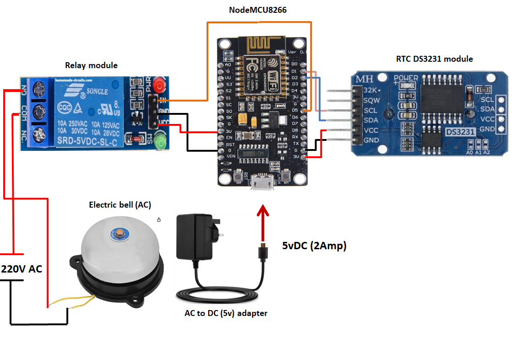

# smart_schoolBell_system_using_NodeMCU8266
Smart school bell system for automatically triggering bells with high precision, ensuring accuracy and eliminating human error.

# 🔔 Smart School Bell System (ESP8266)

A fully automated **Smart School Bell System** built using **NodeMCU ESP8266**, **DS3231 RTC**, and a **Relay Module**, featuring a powerful **web-based dashboard** for scheduling and controlling school bells.

> ⚡ No external web files required — dashboard is embedded inside firmware.

## ✨ Features

- ⏰ Real-time bell scheduling using DS3231 RTC
- 🌐 Built-in web dashboard (HTML/CSS/JS embedded in firmware)
- 📅 Weekly timetable management
- 🔔 Custom bell patterns (strokes & duration)
- 📶 WiFi configuration (AP + Station mode)
- 🔐 Login authentication system
- 💾 Persistent storage using LittleFS
- 📱 Fully responsive UI (mobile + desktop)
- ⚡ Manual bell trigger (For Testing Bell)

## 🛠️ Hardware Requirements

- NodeMCU ESP8266
- DS3231 RTC Module
- 5V Relay Module (Active LOW)
- School Bell (AC 230V)
- Power Supply (5V Adapter)
- Jumper wires

## 🔌 Circuit Connections

### 📍 NodeMCU ↔ DS3231 RTC (I2C)

| DS3231 Pin | NodeMCU Pin |
|-----------|------------|
| VCC       | 3.3V       |
| GND       | GND        |
| SDA       | D2 (GPIO4) |
| SCL       | D1 (GPIO5) |

### 📍 NodeMCU ↔ Relay Module

| Relay Pin | NodeMCU Pin |
|----------|-------------|
| VCC      | VIN (5V)    |
| GND      | GND         |
| IN       | D5 (GPIO14) |

> ⚠️ Relay is **Active LOW**

### ⚡ Relay ↔ School Bell (High Voltage)

| Relay Pin | Connection |
|----------|-----------|
| COM      | Live (L) from mains |
| NO       | Bell Terminal 1 |
| —        | Bell Terminal 2 → Neutral (N) |

> ⚠️ **WARNING:** This section uses **230V AC**. Handle with extreme care.

## ⚡ Power Supply

| Source | Target |
|-------|--------|
| 5V Adapter | NodeMCU (Micro USB) |
| 220V Mains | Bell via Relay |

  

## 🌐 Web Dashboard Access

After uploading code:

### 🔹 AP Mode (Default)
- SSID: `SmartBell-Setup`
- Password: `bellsystem`
- Open: `http://192.168.4.1`

## 🔐 Default Login
  - Username: admin
  - Password: admin123

## 📦 Libraries Required

Install via Arduino Library Manager:

- `ArduinoJson (v6.x)`
- `RTClib by Adafruit`

## ⚙️ Board Settings

- Board: NodeMCU 1.0 (ESP-12E)
- Flash Size: 4MB (FS:2MB OTA:~1019KB)
- CPU Frequency: 80 MHz

## 🚀 Installation

### 🔗 Repository
git clone https://github.com/Abdulrauf1122/smart_schoolBell_system_using_NodeMCU8266.git

### ⚙️ Setup Steps
1. Open the `.ino` file in Arduino IDE  
2. Install required libraries  
3. Select the correct board & COM port  
4. Upload the code  

## 🧠 How It Works

- RTC keeps accurate time  
- ESP8266 checks schedule every second  
- When time matches → Relay triggers the bell  
- Dashboard provides full control via browser  

## ⚠️ Safety Note

This project involves **high voltage (220V AC)**.  
Improper handling can cause serious injury.

👉 Always:
- Use proper insulation  
- Avoid touching live wires  
- Seek supervision if unsure  

## 👨‍💻 Author

**Abdul Rauf Afridi**

## ⭐ Support

If you like this project:

- ⭐ Star the repository  
- 🍴 Fork it  
- 📢 Share with others  

## 📜 License

This project is open-source and available under the **MIT License**.

## 💬 Feedback

**If you find any issues or have suggestions, feel free to open an issue or reach out.**
